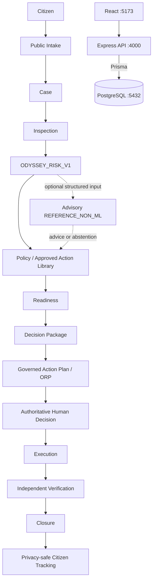

# JanSeva IntelliGov / Project ODYSSEY

Phase-1 government infrastructure decision-support platform. It combines deterministic risk assessment, governed policy/actions, human approval, accountable execution, independent verification, closure and citizen transparency.

> This software supports authorized officers. It does not issue legal orders, approve expenditure, dispatch personnel, control infrastructure, certify structural safety or replace engineering judgement. The optional intelligence provider is an untrained deterministic reference fixture, not production ML.

## Quick start

Prerequisites are PostgreSQL 16 and Node/npm; Python is optional. No Node or Python engine range is declared. This closure pass used Node 25.6.1/npm 11.9.0; Python was unavailable and is not claimed as tested.

```powershell
Copy-Item .env.example .env
docker compose up -d db
npm install
cd apps/api; npm install; cd ../..
cd apps/web; npm install; cd ../..
npx prisma generate --schema database/prisma/schema.prisma
npx prisma migrate deploy --schema database/prisma/schema.prisma
npm run dev
```

Root `npm run dev` supervises API :4000 and web :5173, stopping the peer when one fails. It does not start PostgreSQL or Python.

The API build publishes an immutable, versioned runtime under the ignored `apps/api/.runtime-builds` directory. `npm start` resolves the atomically published current-build pointer. A later `npm run build` therefore does not overwrite files used by an already-running API and is supported while that API remains active.

- API health: http://localhost:4000/api/v1/health
- Web: http://localhost:5173
- Optional intelligence health: http://localhost:8000/health

## Fresh clone

```powershell
git clone <repository-url>
cd project-odyssey-build001
Copy-Item .env.example .env
docker compose up -d db
npm install
cd apps/api; npm install; cd ../..
cd apps/web; npm install; cd ../..
npx prisma validate --schema database/prisma/schema.prisma
npx prisma generate --schema database/prisma/schema.prisma
npx prisma migrate deploy --schema database/prisma/schema.prisma
npm run dev
```

Use `cp` on POSIX. Installation is per package because this is not an npm workspace.

## Architecture

- `apps/api`: Express/TypeScript authentication, governance, workflow and persistence boundary.
- `apps/web`: React/Vite operator and public UI.
- `apps/ai`: optional stateless FastAPI advisory reference provider.
- `database/prisma`: authoritative PostgreSQL schema and migrations.
- `scripts`: supervisor and guarded isolated browser-test environment.



The core remains usable if AI is unavailable. Deterministic safety and human governance remain authoritative.

## Configuration

Copy `.env.example` to ignored `.env`. Replace all placeholders and never commit credentials.

| Variable | Purpose |
|---|---|
| `NODE_ENV` | Exact runtime mode: development, test, staging, or production. |
| `API_PORT`, `ALLOWED_ORIGINS`, `TRUST_PROXY` | Listener, explicit browser allowlist, and bounded reverse-proxy trust. |
| `API_PUBLIC_BASE_URL`, `WEB_PUBLIC_BASE_URL` | Externally reachable deployment URLs. |
| `VITE_API_BASE_URL` | Browser API URL ending in `/api/v1`. |
| `DATABASE_URL` | PostgreSQL URL; secret-bearing. |
| `JWT_SECRET` | Strong private signing secret. |
| `JWT_ISSUER`, `JWT_AUDIENCE`, `JWT_ACCESS_TTL_SECONDS` | Access-token boundaries/lifetime. |
| `ODYSSEY_INTELLIGENCE_ENABLED`, `...SERVICE_URL`, `...TIMEOUT_MS` | Explicit optional advisory state, URL, and fail-fast timeout. Credential-bearing URLs are rejected. |

## Database and migrations

```powershell
npx prisma validate --schema database/prisma/schema.prisma
npx prisma migrate status --schema database/prisma/schema.prisma
npx prisma generate --schema database/prisma/schema.prisma
npx prisma migrate deploy --schema database/prisma/schema.prisma
```

`migrate deploy` applies committed migrations: inspect `DATABASE_URL` first. Never use `prisma migrate reset` on valued data. Migration `20260823010000_add_risk_source_fingerprint` enables `pgcrypto`, backfills deterministic inspection fingerprints and adds a unique index. Equivalent pre-existing assessments may make the index fail; preserve history and resolve duplicates only through approved, backed-up data remediation.

Migration `20260822210000_add_intelligence_provider_type` was safe on the current baseline because the intelligence table was empty. A populated installation needs an explicit upgrade/data review before applying it; do not blindly deploy it or rewrite historical migrations.

Optional `npx prisma studio --schema database/prisma/schema.prisma` exposes operational data and must remain trusted/local.

Start with `npm run dev`; stop foreground services with Ctrl+C. The root supervisor targets only the API/frontend process trees it started and waits up to five seconds for their PIDs to disappear. Stop only the database using `docker compose stop db`. Do not add `-v` unless volume deletion is explicitly authorized. Identify ownership before stopping any process holding ports 4000, 5173, 8000, 4100 or 5174.

## Optional intelligence service

```powershell
cd apps/ai
py -m venv .venv
.\.venv\Scripts\Activate.ps1
python -m pip install -r requirements.txt
python -m uvicorn app.main:app --reload --port 8000
```

POSIX activation is `source .venv/bin/activate`. The provider accepts structured non-PII features, has no database and may abstain. It cannot approve, execute, verify or close.

## Pilot Compose deployment

This is a single-host pilot package, not production high availability. It requires Docker with the Compose plugin. Local development continues to use `npm run dev`; the commands below use production builds and isolated container networking.

1. Copy `.env.pilot.example` to the ignored file `.env.pilot`.
2. Replace every `replace-*` value. Use a long random JWT secret and distinct URL-safe owner, migration, runtime, and backup database passwords; keep each role URL consistent with its identity and container host `db`.
3. Review the populated-database migration caveats above.
4. Start the deterministic stack:

```powershell
node scripts/pilot-compose.mjs --env-file .env.pilot up --build -d
docker compose --env-file .env.pilot ps
```

The pilot launcher rejects occupied API or Web host ports explicitly and never selects an alternate port, including on Docker Desktop/WSL hosts whose forwarding layer may otherwise accept an ambiguous duplicate publication. It then delegates the unchanged arguments to Compose. Compose starts PostgreSQL, waits for its health check, runs the one-shot `prisma migrate deploy` service, then starts the API and waits for API health before starting the web server. No reset, development migration, seed, or G6 bootstrap runs automatically.

Pilot endpoints:

- Web and same-origin API proxy: `http://localhost:8080`
- Direct API diagnostics: `http://localhost:4000/api/v1/health`
- PostgreSQL and AI are internal by default.

Enable the optional advisory provider with:

```powershell
node scripts/pilot-compose.mjs --env-file .env.pilot --profile ai up --build -d
```

The API does not depend on AI container health. Without the profile—or while AI is unavailable—core deterministic workflow remains available and intelligence invocation fails safely. The provider remains `REFERENCE_NON_ML`, stateless, non-authoritative and untrained.

Useful operations:

```powershell
docker compose --env-file .env.pilot logs -f api web migrate
docker compose --env-file .env.pilot restart api web
docker compose --env-file .env.pilot down
```

`down` preserves the named PostgreSQL volume. A later `up` reuses it. Only an explicitly authorized isolated pilot cleanup should use `docker compose --project-name <verified-isolated-name> down --volumes`; never use volume deletion against an unverified or canonical project.

To verify or populate the governed synthetic demo, wait for stack health and run the existing API commands from a separately configured operator environment. Set `ODYSSEY_API_BASE_URL=http://localhost:4000/api/v1` and the six private demo passwords, then run the documented dry-run/bootstrap/idempotency/verification sequence. Demo bootstrap remains explicit.

Deployment troubleshooting:

- If role provisioning or `migrate` fails, inspect its controlled logs and the corresponding owner/migration role configuration without printing credentials; do not reset the database. New or existing volumes must complete the explicit `operations` profile provisioning procedure in `docs/phase3-pilot-deployment-preflight.md` before API startup.
- If API startup rejects `JWT_SECRET`, supply a non-placeholder value of at least 32 characters.
- If web loads but API calls fail, verify API health, `ODYSSEY_ALLOWED_ORIGINS`, public URLs, and the nginx `/api/` proxy.
- Host-port collisions are reported by Docker/API; identify ownership and never kill an unknown process.
- Container logs use stdout/stderr. No Docker socket, privileged mode, host source mount, or application log volume is required.

## Roles and scope

Login is `POST /api/v1/auth/login`; `GET /api/v1/auth/me` resolves the active database user. Logout is client-side token disposal; Phase 1 has no refresh/revocation service.

| Role | Boundary |
|---|---|
| OFFICER | Scoped inspections/risk/workflow, subject to explicit authority and four-eyes gates. |
| POLICY_ADMIN | Versioned policy, approved-action and execution-template lifecycle administration; operationally read-only. |
| AUDITOR | Read-only accountability visibility in permitted scope. |
| SYSTEM_ADMIN | Registry/identity/authority administration and global reads; not officer execution or closure authority. |
| CITIZEN (public, not a staff role) | Submit a report and use privacy-safe public tracking; no internal Case, governance or reporter-record access. |

Scope comes from authenticated persisted identity, never client actor/department IDs. Closure requires explicit `canCloseCase`; designation or role alone grants no authority.

## Workflow and recovery

`Public report/Case → Inspection → deterministic Risk Assessment → policy/action resolution → Decision Package → governed Action Plan (ORP) → Human Decision → Execution → Evidence → independent Verification → authorized Closure`

Normal Case states are `NEW → INSPECTION_IN_PROGRESS → ORP_READY → APPROVED → EXECUTION → VERIFICATION → CLOSED`. `REINSPECTION_REQUESTED` returns the Case to `INSPECTION_REQUIRED`; a new Inspection and Risk lead to `ORP_READY` and new package/ORP versions. `MODIFICATION_REQUESTED`, `REJECTED` and `ESCALATED` move to `UNDER_REVIEW`; new Inspection/Risk can return to `ORP_READY` and create new package/ORP versions. Historical plans and Human Decisions remain immutable.

- Risk generation is fingerprint-idempotent for unchanged inspection inputs.
- The same Case, Inspection, `ODYSSEY_RISK_V1` version and structured inputs reuse one canonical assessment. A new Inspection or future engine version is logically distinct.
- Reinspection invalidates the prior operating basis; assess the new inspection before downstream planning.
- AI cannot weaken deterministic critical escalation.
- Missing/conflicting/expired/out-of-scope policy, prohibited actions, low confidence or provider failure produce abstention/unresolved results—not guesses.
- Action-plan generation never approves a Case.
- Rejection, modification and reinspection are explicit preserved recovery branches.
- Assignees must be active and in scope; the authenticated assigner is recorded.
- Assignment is from `PENDING` only, is not reassigned afterward, and candidates are server-authoritative active OFFICER users in the exact Case department/jurisdiction. An empty pool requires identity/organization setup.
- Completion submitter cannot verify the same task.
- Closure requires completed independent verification and explicit closure authority. It is terminal; Phase 1 has no reopen endpoint.

Read the timeline and correct the failed scope, authority, inspection, governance, assignment, evidence, verifier or closure precondition. Never patch canonical rows to bypass a gate.

## Governed G6 demo

The bootstrap is synthetic, deterministic, idempotent and development-only. It never runs on startup/install/migration/build/tests, refuses production, uses authenticated APIs, does not reset/reseed, and stops on scope/ownership conflicts.

Set locally: `ODYSSEY_DEMO_ADMIN_PASSWORD`, `ODYSSEY_DEMO_OFFICER_PRIMARY_PASSWORD`, `ODYSSEY_DEMO_OFFICER_VERIFIER_PASSWORD`, `ODYSSEY_DEMO_OFFICER_CLOSER_PASSWORD`, `ODYSSEY_DEMO_POLICY_ADMIN_PASSWORD`, and `ODYSSEY_DEMO_AUDITOR_PASSWORD`. Optional: `ODYSSEY_DEMO_ADMIN_EMAIL`, `ODYSSEY_API_BASE_URL`, `ODYSSEY_DEMO_DEPARTMENT_CODE`, `ODYSSEY_DEMO_JURISDICTION_NAME`. Never display or commit values.

With API running, from `apps/api`:

```powershell
npm run demo:bootstrap -- --dry-run
npm run demo:bootstrap
npm run demo:bootstrap
npm run demo:verify
```

Dry-run writes nothing; the second mutation run proves idempotency and preserves ahead-of-target history. Optional map metadata uses `npm run demo:geo -- --dry-run` then separately authorized `npm run demo:geo`. Coordinates are synthetic Pune-area presentation data, not surveyed GIS evidence.

## 8–10 minute judge walkthrough

1. Public report/tracking: show privacy-safe status, not reporter contact/internal notes.
2. Primary officer: open a synthetic Case and timeline.
3. Show inspection, deterministic risk, reason codes and idempotency; state hard rules are authoritative.
4. Show advisory confidence/factors/abstention and state it is untrained and non-decisional.
5. Policy admin: show version provenance and mandatory/recommended/optional/prohibited actions.
6. Show immutable decision package, governed action plan and explicit human decision/recovery.
7. Show scoped assignment, evidence, completion and verification by a different officer.
8. Show closure by a separately authorized closer and accountability timeline.
9. Return to privacy-safe citizen tracking.
10. State limitations: no autonomous decision, production ML, physical action, finance/procurement certification or reopen.

Also show the Infrastructure Map if time permits. Say explicitly that policy and coordinates are synthetic, the provider is `REFERENCE_NON_ML`, confidence is not failure probability, AI never approves, and the Human Decision is authoritative.

Synthetic personas are Arjun Deshmukh (primary), Meera Kulkarni (verifier), Vikram Joshi (closer), Ananya Rao (policy admin), and Kabir Shah (auditor). Use private configured credentials.

## Governance administration

Create draft policy/action/template versions in correct scope with stable code, provenance and effective dates. Validate/approve before activation; AI text is never authoritative. Check conflicts/prohibitions, then activate. Supersede/archive old versions rather than rewriting versions referenced by packages/plans. System administrators manage organizational registries and explicit authorities separately; never grant power merely to bypass a demo gate.

## Validation

```powershell
cd apps/api
npx tsc --noEmit
npm test
npm run build
```

```powershell
cd apps/web
npm run typecheck
npm test
npm run build
npx playwright install chromium
npm run test:e2e
```

AI (when Python dependencies exist): `cd apps/ai; python -m pytest`.
Repository checks: `npx prisma validate --schema database/prisma/schema.prisma`, `npx prisma migrate status --schema database/prisma/schema.prisma`, and `git diff --check`.

The C6 Playwright suite uses API :4100, web :5174 and a guarded temporary PostgreSQL schema with prefix `odyssey_e2e_c6`. It migrates/seeds only that schema and teardown drops it; it refuses canonical/default schema and does not run G6 bootstrap. Set optional `C6_E2E_PASSWORD` only locally. Verify the DB server and ports first. After interruption, rerun for cleanup, then inspect for `odyssey_e2e_c6%` before any manual action; never blindly drop a schema.

The legacy mutable `apps/api/dist` layout is no longer the build/runtime boundary. Each API build compiles and packages Prisma into a private staging directory, validates required runtime files, and only then publishes a new immutable version. Partial staging output is never selected by `npm start`.

## Troubleshooting

- **Login:** confirm active user/email, matching API/web environment, private current G6 passwords and fresh token. Never patch hashes or print secrets.
- **CORS:** include the exact browser origin in `ALLOWED_ORIGINS` and restart API; configure `VITE_API_BASE_URL` only with public browser-safe values.
- **Prisma connection:** verify Postgres, database, URL and credentials; run validate/status, not reset.
- **Fingerprint migration:** preserve failure output and remediate duplicates under reviewed backup/governance.
- **Port 4000/5173 collision:** Odyssey does not kill the listener or silently select a new port. Identify its PID and ownership. Stop it only when it is a confirmed process you own.
- **Prisma runtime lock:** normal builds no longer modify the live runtime. The standalone copy helper reports `PRISMA_RUNTIME_IN_USE` if explicitly asked to replace an occupied destination; it never retries forever or kills a process.
- **Old immutable builds:** versioned API runtimes are ignored local artifacts. After all Odyssey API processes are confirmed stopped, old directories under `apps/api/.runtime-builds` may be removed; retain `current.json` and its referenced directory when the current package is needed.
- **Prisma Studio `ECONNRESET`:** retry the local connection and inspect network/process state; it is not evidence of database corruption.
- **Demo `AUTH_RATE_LIMITED`:** do not weaken the limiter; allow its window to reset. Bootstrap already authenticates lazily.
- **Demo `INVALID_CREDENTIALS`:** verify private synthetic credential configuration; never hard-code or bypass authentication.
- **Playwright browser missing:** from `apps/web`, run `npx playwright install chromium`; browser binaries live in the user's Playwright cache and are not committed.
- **AI unavailable/stale/invalid:** check :8000, URL and timeout; deterministic processing must continue and abstention must not be rewritten.
- **Governance absent:** inspect status, dates, scope, version, conflicts and enforcement; never invent applicability.
- **Assignment/verification/closure forbidden:** check active identity, exact scope, explicit authority and four-eyes separation.
- **Interrupted E2E:** preserve logs, rerun guarded cleanup, then read-only inspect the isolated schema.

## Security, privacy and limitations

Keep env files, DB passwords, JWTs and bearer tokens out of Git, screenshots and logs. Production requires TLS, secret management, least-privilege DB/network access, audited backups and monitoring. Reporter contact is sensitive and public DTOs must remain privacy-safe. Advisory input excludes reporter PII/prompts/free text and cannot write authoritative tables. Synthetic data/coordinates are not production evidence; confidence is input completeness, not failure probability.

Passwords are bcrypt-hashed. JWT authentication, RBAC, organizational scope, explicit ApprovalAuthority and four-eyes verification are separate controls. Citizen tracking isolates reporter PII. AI receives only allow-listed structured features, no Odyssey bearer token, and has no database access. These are architectural controls, not a formal penetration-test claim. Rate limiting is local/in-memory; production SSO, distributed limiting and a full production secret manager are not Phase 1.

Phase 1 does not provide refresh-token revocation, production identity federation, calibrated production ML/drift operations, statutory signing, procurement/payment, physical dispatch/control or reopen. Production deployment also needs environment-specific disaster recovery, observability, accessibility/security certification and retention governance.

## Phase 1 and Phase 2

Phase 1 includes registries, trusted scoped identity, citizen reporting/triage/tracking, inspections/reinspection, deterministic risk, policy/action/template governance, decision packages/action plans, human decisions/recovery, scoped execution/evidence, four-eyes verification, authorized closure, timelines/briefs/maps, advisory integration, governed demo and isolated browser E2E.

Phase-2 candidates—not delivered—include identity federation/revocation, reopen/appeal, notifications/external integrations, verified GIS, finance/procurement interfaces, production operations hardening, and responsible model development only after legitimate representative data and governance exist.

Specifically deferred are legitimate trained ML, real government-policy ingestion, GIS/weather/IoT feeds, procurement/budget ERP, external evidence object storage, enterprise SSO, distributed rate limiting, production observability and large-scale deployment.

## Operator checklist

- [ ] Confirm branch/worktree and review local changes.
- [ ] Create ignored `.env`; replace JWT/DB placeholders.
- [ ] Confirm non-production DB; validate/status/deploy without reset.
- [ ] Install root/API/web; install Python only if needed.
- [ ] Start services and check health URLs.
- [ ] Confirm ports are free, no development errors are visible, browser zoom/display is normal, and core local workflow needs no internet.
- [ ] Verify role, scope and explicit authorities.
- [ ] G6: dry-run, bootstrap twice, verify; keep credentials private.
- [ ] Confirm the synthetic-data warning is visible and canonical demo verification passes.
- [ ] E2E: verify isolated guard and ports 4100/5174.
- [ ] Present deterministic risk before advisory AI and state limits.
- [ ] Demonstrate provenance, human decision, assignment, four-eyes and closure.
- [ ] Confirm public views expose no reporter contact/internal governance.
- [ ] Run all checks and `git diff --check`.
- [ ] Inspect artifacts/secrets before any later commit.
- [ ] Stop only owned processes; never delete DB volumes accidentally.
- [ ] After demo, preserve canonical state, expose no `.env`, and stop services normally.
